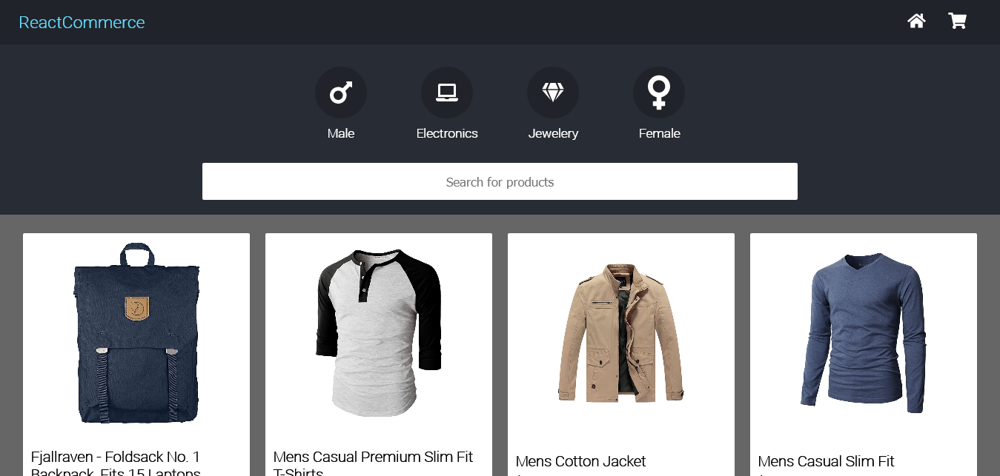

<h2 style="text-align: center">ReactCommerce</h2>

That's a front end only ecommerce, being built with react, typescript and styled components.

-----------------------------------------------------------------------------------------------------------------------------

#### Brief
* Every route will have a header component
* Main page contains a searcher, to filter the products' list, and also the product's list
* Users will be able to see pages dedicated to each product, add and remove items to the cart, also edit items quantity.
* There will be a checkout component, where the fields can be filled in and validated. If it validates, users will be able to see a modal containing information about the shipping.

-----------------------------------------------------------------------------------------------------------------------------

### Libs used so far
* Styled components
* React router dom

-----------------------------------------------------------------------------------------------------------------------------

### Snapshot


-----------------------------------------------------------------------------------------------------------------------------

##### Progress
- [x] Start the project.
- [x] Start creating components styles.
- [ ] Header component with cart icon that shows items quantity in the cart.
- [ ] Store cart items in local storage, so that the user doesn't lost their items when closes the browser.
- [x] Filter products list not only by filter worlds, but also clicking in a category.
- [ ] Checkout form with validations.
- [ ] Modal with shipping summary.
- [ ] Create avaliations field on detailed page for every product.
- [ ] Keep track of user's shipping historic, and create a dashboard to see it

-----------------------------------------------------------------------------------------------------------------------------

### How to contribute 

```
    ## Fork this repository

    ## Create a new branch containing your feature
    git checkout -b feature

    ## Commit your changes
    git commit -m "new feature"

    ## Push to your branch
    git push origin feature

    ## After your pull request's merge has been done, you can delete your branch

```

-----------------------------------------------------------------------------------------------------------------------------

### Author

- Website - [Romario Negreiros](https://romario-negreiros.github.io/Romario-frontend/)
- Frontend Mentor - [@Romario-Negreiros](https://www.frontendmentor.io/profile/Romario-Negreiros)
- Github profile - [Romario-Negreiros](https://github.com/Romario-Negreiros)
